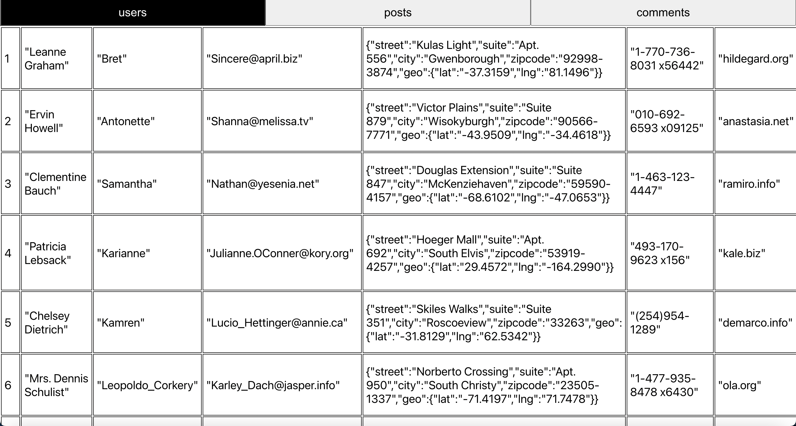

# Hack Technology / Project Attempted

## What you built? 

TODO: Short description of what you attempted to build
I wanted to learn about the React JS framework and library, so I follow some tutorials to build multiple projects to get 
familiarity with the platform. All of the projects except for the second one are connected to a backend, so I also learned how to implement an API to retrieve the necessary data from a server. I also learned how to use the easy peasy library, as well as a Data Context file/useContext hook to better organize the states and props used between components. 

I first built a grocery list screen where the user can add, delete, or search for items in the list. They can check and uncheck items from this list. The code for this screen is in the folder first_tutorial. 

I then built a screen where the user can type in a color and that color will be displayed in the square as seen in the screenshot. The hexcode and the color name are also titled in the square and the user can change the text color of those words using the "Toggle Text Color" button. The code for this project is in a folder titled second_tutorial. 

The third project I worked on are three tables for users, posts, and comments, where this data is collected from jsonplaceholder.com. The user can switch between the three tables. The code for this project is in a folder titled third_tutorial. 

The fourth project I worked on is a React JS blog where the user can make posts, edit posts, and delete them. This blog also have an about page. The laptop icon on the top right of the screen will also change to a tablet or phone icon based on the width of the screen. With this project, I learned how to use React Router. The code for this project is in a folder titled fourth_tutorial. 

Include some screenshots.
[How?](https://help.github.com/articles/about-readmes/#relative-links-and-image-paths-in-readme-files)

## Who Did What?

I worked on everything. I worked alone. 

## What you learned

I really enjoyed learning React and I liked how we can organize everything into components, which has made working on multi-faceted projects easier. While I found the concept of states and props a bit confusing at first, working on multiple projects helped me understand their value, especially when it comes to connecting different components together. However, I did find the React Router library to be unintuitive and a bit confusing, especially with its most recent update that removed some common functions and replaced them. 

## Authors

Vaani Gupta

## Acknowledgments

I primarily followed Dave Gray's 9 hour React JS Full Course Tutorial (https://www.youtube.com/watch?v=RVFAyFWO4go) to complete these 4 projects (which were suggested by this tutorial). However, to get more insights on React Router, I also referenced Codr Kai's React JS URL Page Routing tutorials (https://www.youtube.com/watch?v=U7oPfhHAzLc). 
